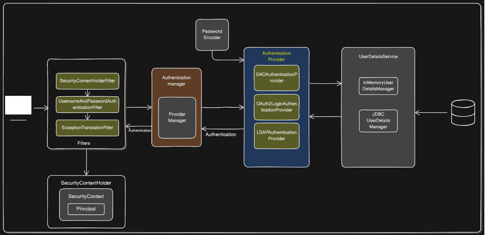

# 📘 Spring Security Demo Application

This is a simple Spring Boot application demonstrating **Basic authentication using Spring Security** with **PostgreSQL**, a **custom `UserDetailsService`**, and a layered architecture.

---

## 🧠 Implementation

- How Spring Security filters work in the authentication flow
- How to implement a `UserDetailsService` backed by a database (PostgreSQL)
- Setting up DAO-based authentication with a custom user entity
- How to initialize a default admin user on startup
- A basic form-based login with Thymeleaf templates

---

## 🏗️ Project Structure

```bash
src
├── main
│   ├── java
│   │   └── com.mulk.springsecuritydemo
│   │       ├── config                 # Security configuration (Spring Security setup)
│   │       ├── controller             # AuthController for login/dashboard logic
│   │       ├── model                  # User entity with JPA annotations
│   │       ├── repository             # UserDetailsRepository for DB access
│   │       ├── service
│   │       │   ├── AdminUserInitializer  # Initializes default admin user
│   │       │   └── CustomUserDetailsService # Loads users by username for auth
│   │       └── SpringSecurityDemoApplication # Main entry point
│   ├── resources
│   │   ├── static                    # Static resources (e.g., CSS/JS)
│   │   ├── templates                 # Thymeleaf templates for login/dashboard
│   │   └── application.properties    # DB + Hibernate config
```

---
## 🔐 Spring Security Architecture

The application uses **Spring Security's filter chain** with the following flow:



### Flow Summary:
1. **Request hits filters** like `UsernamePasswordAuthenticationFilter`
2. Filter passes credentials to `AuthenticationManager`
3. `AuthenticationManager` delegates to `DaoAuthenticationProvider`
4. `DaoAuthenticationProvider` uses your `CustomUserDetailsService`
5. The service loads the user from PostgreSQL using `UserDetailsRepository`
6. Authentication succeeds and context is set

---

## ⚙️ Configuration

### `application.properties`

```properties
spring.datasource.url=jdbc:postgresql://localhost:5432/security_demo
spring.datasource.username=USERNAME
spring.datasource.password=PASSWORD
spring.jpa.hibernate.ddl-auto=create-drop
spring.jpa.show-sql=true
spring.jpa.properties.hibernate.format_sql=true
spring.jpa.properties.hibernate.dialect=org.hibernate.dialect.PostgreSQLDialect
```
---

## 🛠️ Key Components

### 🔐 CustomUserDetailsService.java

```java
@Service
@RequiredArgsConstructor
public class CustomUserDetailsService implements UserDetailsService {
    private final UserDetailsRepository userDetailsRepository;

    @Override
    public UserDetails loadUserByUsername(String username) throws UsernameNotFoundException {
        return userDetailsRepository.findByUsername(username)
            .orElseThrow(() -> new UsernameNotFoundException("User not found"));
    }
}
```
---

### 🔐 SecurityConfig.java

```java
@Configuration
@EnableWebSecurity
@RequiredArgsConstructor
public class SecurityConfig{

    private final CustomUserDetailsService customUserDetailsService;

    @Bean
    public SecurityFilterChain filterChain(HttpSecurity http) throws Exception {
        http
                .authorizeHttpRequests(auth -> auth
                        .requestMatchers("/login").permitAll()
                        .anyRequest()
                        .authenticated()
                )
                .httpBasic(withDefaults());
        return http.build();
    }
}
```
---
### 🧑‍💼 Admin User Initialization
The AdminUserInitializer component adds a default admin user at application startup if no users exist in the database. This ensures you have at least one login credential when the app is launched for the first time.
```java
@Bean
    public CommandLineRunner createAdminUser(UserDetailsRepository repo, PasswordEncoder passwordEncoder) {
        return args -> {
            if (repo.findByUsername("admin").isEmpty()) {
                User admin = new User();
                admin.setUsername("admin");
                admin.setPassword(passwordEncoder.encode("Admin1")); //Securely store password
                admin.setRole("ROLE_ADMIN");

                repo.save(admin);
                System.out.println("Default Admin Created");
            }
        };
    }
```
---
## 💻 Thymeleaf Templates

- `login.html`: Custom login form
- `dashboard.html`: Simple dashboard page shown post-login
- 
> All templates are located in `src/main/resources/templates`.
---

## 🧪 Running the App

1. Ensure PostgreSQL is running and a `security_demo` database exists.
2. Run the Spring Boot application.
3. Visit: `http://localhost:8080/login`
4. Login using the default admin credentials initialized on startup.
---
## 🧑‍💻 Author
©️Ganza Kevin Murinda
